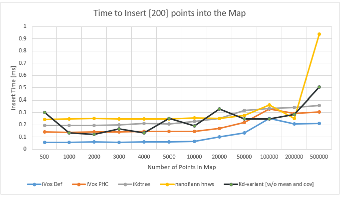
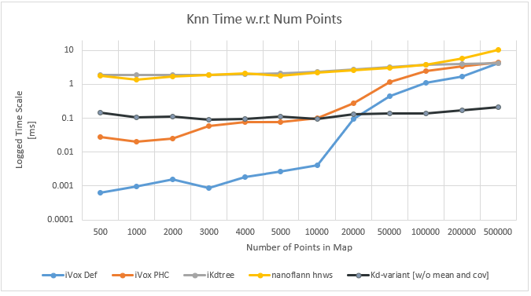

# An Alternative PointStorage

Introducing a new, scalable approach to storing 3D point clouds and a novel method for point-cloud downsampling.

## The Storage Solution

Inspired by the incremental kd-tree (as detailed in [this paper](https://arxiv.org/abs/2102.10808)) and the Faster-LIO method ([documentation here](https://github.com/gaoxiang12/faster-lio/blob/main/doc/faster-lio.pdf)), we have developed a solution optimized for real-time applications. This approach excels in insertion, range-search, and accurate nearest-neighbor search.

Our solution builds on the incremental kd-tree by converting points into voxels. Each voxel is partitioned based on sign-cardinality and stored as octrees. This structure provides the speed of Faster-LIO and maintains performance in dense map scenarios, even with more than 200,000 points. Below is a performance comparison of our kd-variant (benchmarked on an i7-8750) against others (benchmarked on an Intel i7-10750H).

<p align="center">
  
  
</p>

**Note:** We are currently seeking a more performant PC to test our results further, as better hardware should enhance insertion performance.

While this approach increases memory usage due to voxel tracking, it ensures efficient management of large-scale data. Here’s how it works:

- Convert the point to a voxel.
- Check if the voxel exists or needs to be created.
- Insert the voxel into the kd-tree and update the voxel with the points in parallel.
- Each voxel is managed by a cardinal octree with careful memory management.

An added benefit of this voxel implementation is its inherent support for distribution-based searching. Each voxel can optionally track its mean or covariance incrementally. Other functions, such as nearest neighbor/range search (spherical or box), delete operations, and rebalancing, follow the same scheme as the incremental kd-tree with some modifications.

## The Downsampling Algorithm

In lidar applications, particularly for indoor solutions, filtering out crucial information in dense regions is a significant challenge. Our downsampling algorithm addresses this by maintaining distinct features, which provides a balanced basis for scan matching. Inspired by the octree downsampling scheme, our approach is as follows:

- Segment the point cloud into sign cardinality and then voxels.
- Store points in each voxel by squared norm and uniformly select points after sorting.
- Key parameters are variance and point density. Regions with high variance and density get more representation, while sparse regions get minimal representation. Consequently, a sparse cloud might not be downsampled, depending on variance and density.

For detailed implementation, see `map_storage/sections/kd_tree/specialized.cpp`. On average, it takes 10ms to downsample ~50,000 points by half.

## Dependencies

Tested on Ubuntu 18.04 and 20.04, the following libraries are required:

1. C++14 or higher.
2. Eigen.
3. TBB (Threading Building Blocks).
4. Boost.
5. Sophus.

Dependencies 2-5 will be installed via CMake if not already installed. Ensure to run:

```sh
chmod +x thirdparty/install_deps.sh
```

## Compilation

Debug Mode:

```sh
mkdir -p build/debug && cd build/debug
cmake -DCMAKE_BUILD_TYPE=Debug ../..
make

```

Release Mode:

```sh
mkdir -p build/release && cd build/release
cmake -DCMAKE_BUILD_TYPE=Release ../..
make

```

## Running the Program

Execute with generated data, ensuring you are in the directory with the release or debug folders:

```sh
clear && cmake --build . && ./bin/map_storage_exec


```

**Note:** Extensive examples on how things are instantiated are in the `src/run.cpp` file. Also, the `faster_lio_trial` function shows the ideal use case.

## Citation

if you use this project in your work please citer as follows:

```
@misc{AlternativePointStorage2024,
  author       = {Oreoluwa Seweje},
  title        = {An Alternative PointStorage},
  year         = {2024},
  url          = {<https://github.com/Oreoluwa-Se/map_storage}>,
  note         = {A scalable approach to storing 3D point clouds and a novel method for point-cloud downsampling},
}
```
